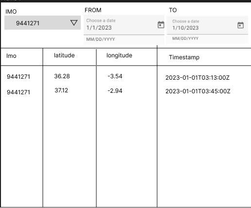

# Assignment

Automatic Identification System (AIS) data is information about the location and characteristics of ships in real time. It was developed to provide identification and positioning information to both vessels and shore stations. For more info, refer: [AIS](https://en.wikipedia.org/wiki/Automatic_identification_system). From this data, we perform several insights and utilize them for our further calculations.

The goal is to fetch the AIS messages for a particular ship on a defined time range. Implement the API and web app for the functionality.

## AIS data

Sample AIS data is provided [here](./ais-data.csv)

Fields:

   1. IMO: The IMO ship identification number is a unique ship identifier.
   2. LAT and LON: LAT and LON are parameters or coordinates that help determine the location of any place on Earth. They produce the current position of the ship on Earth.
   3. BaseDateTime: The timestamp in UTC when the position is recorded.

## Requirements

1. Create a /POST endpoint to insert data with required validations.
2. Create a /GET endpoint to fetch the AIS points in a given from/to date range.
3. Implement the web app similar to [mockup](#demo-mock-up).

## Tech Stack

Not any strict requirements on the stack. Any clean stack can be chosen.

>Example: .Net, PostgreSQL, Angular.

## Demo mock-up

For your reference, This is a demo mock up, does not need to be the same.

**Note**:

* Share the application code via Private GitHub repository, and provide access to `tejagsp`.
* Please write clear instructions on the stack used and how to run the app.
* Code to be self-explainable.
* May use a ready-made template to setup the base of the project.
* May use pre-defined libraries for UI components.
